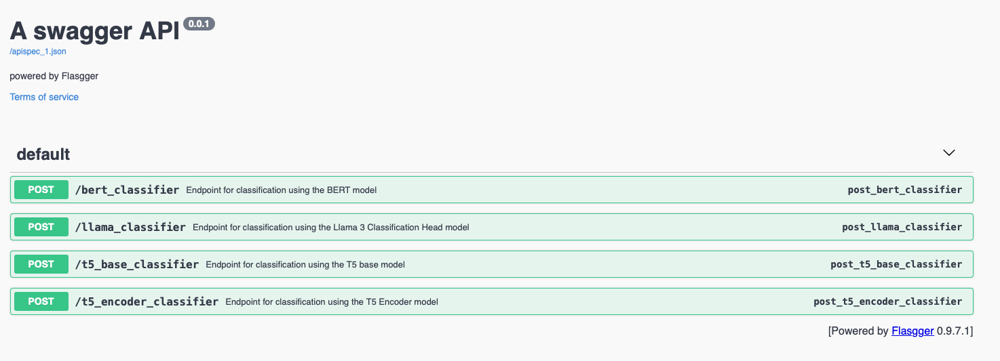
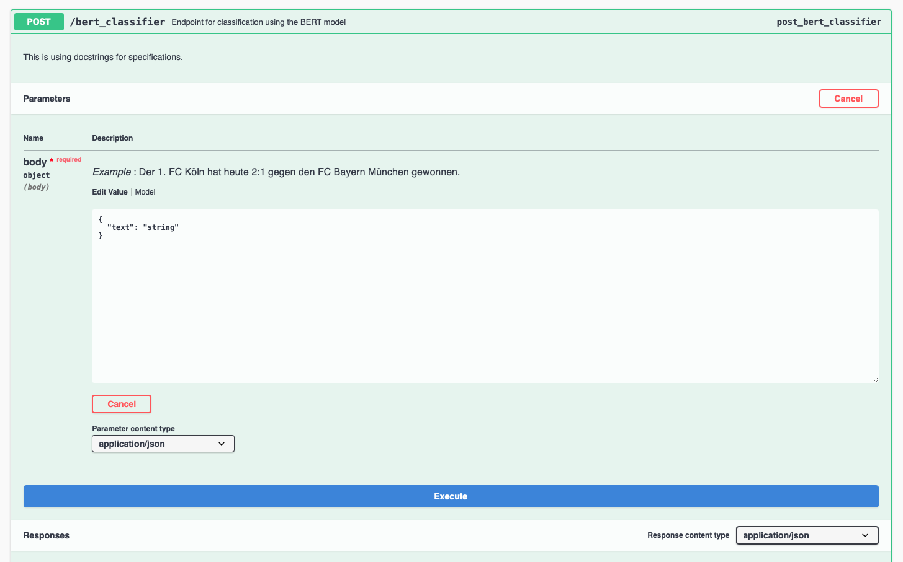
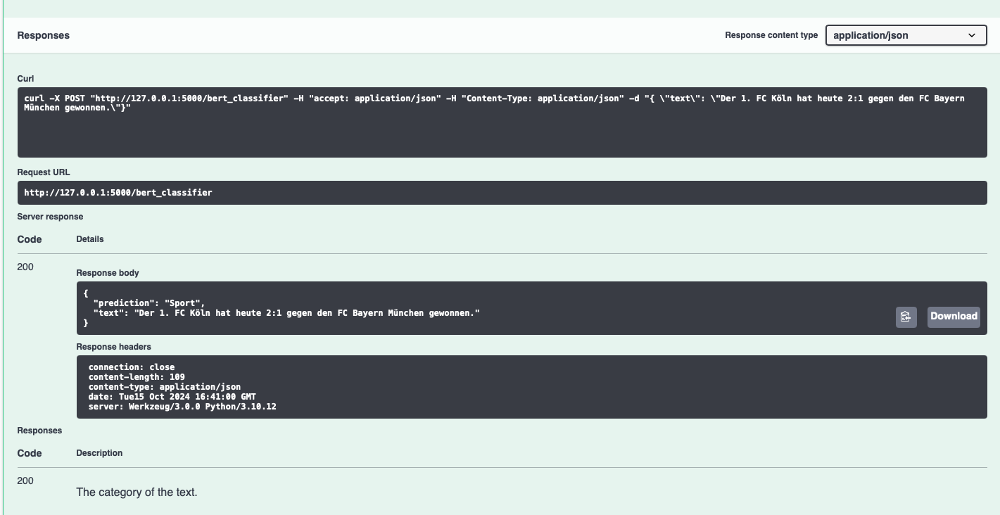

# TextClassifier
Different models for text classification of German newspaper articles

Dataset: https://tblock.github.io/10kGNAD/

## How to use
#### To start the classification_api.py follow these steps:
1. Move all trained models in the correct directory (e.g. ./results/bert_result/model.nosync)
2. Install the requirements.txt
3. Install the Textclassifier module in editable mode (pip install . -e)
4. Execute the classification_api.py (note that the Llama classifier is only availbe on systems with CUDA)
5. Go to the /apidocs URL (http://127.0.0.1:5000/apidocs/) to open the Swagger UI which should look like this:

6. Use one of the available models (e.g. BERT)
    1. Click in the endpoint
    2. Click on Try it out. 
    
    3. Put it a text and execute
    4. The result should look similar to this:
    