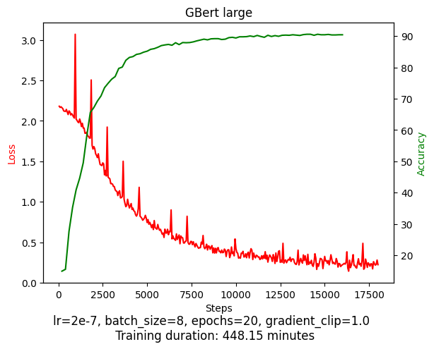
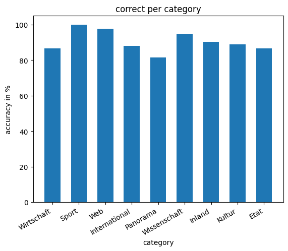
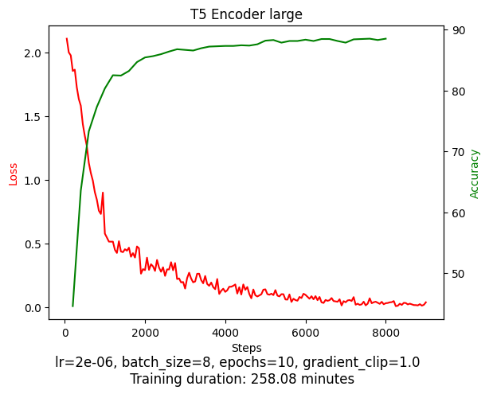
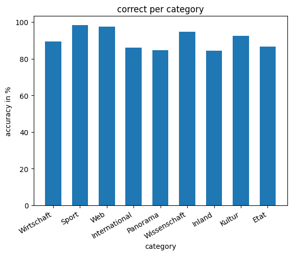
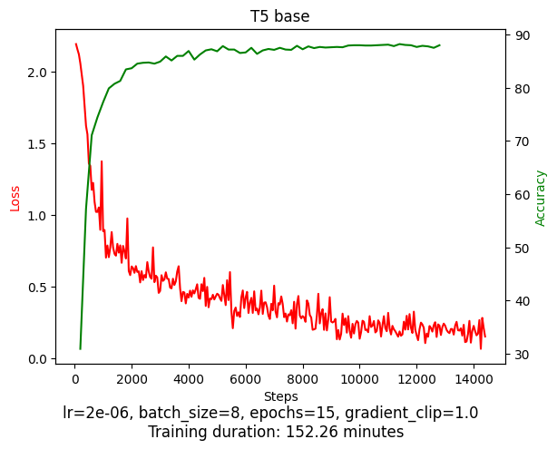
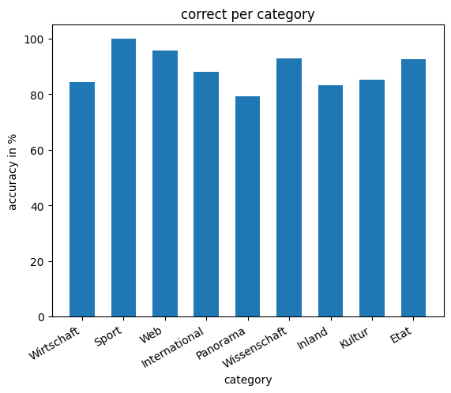

# TextClassifier
Different models for text classification of German newspaper articles

Dataset: https://tblock.github.io/10kGNAD/

### Bert Metrics:
* lr = 2e-7, gradient_clip = True
* 10% dropout
* batch size: 8
* loss logged every 50 steps
* eval accuracy logged every 200
* duration 448.15 minutes
* 
* Testaccuracy: 90.27%, took 0.7174 minutes
* Testaccuracy distribution:
* 

### T5 Encoder Metrics:
* lr = 2e-6
* batch_size = 8
* loss logged every 50 steps
* eval accuracy logged every 200
* duration: 258.08 minutes
* 
* seems to overfit
* Testaccuracy: 90.27%, took 1.00 minute
* Testaccuracy distribution:
* 

### T5 Metrics:
* batch size = 8
* epoch 0-9: lr = 2e-5
* epoch 9-14: lr = 2e-6
* loss logged every 50 steps
* eval accuracy logged ever 200 steps
* duration: 152.26 minutes
* 
* Testaccuracy: 88.72%, took 0.38 minutes
* Testaccuracy distribution:
* 
