# TextClassifier
Different models for text classification of German newspaper articles

Dataset: https://tblock.github.io/10kGNAD/

### Bert Metrics:
* lr = 2e-7, gradient_clip = True
* 10% dropout
* batch size: 8
* loss logged every 50 steps
* eval accuracy logged every 200
* duration 448.15 minutes
* 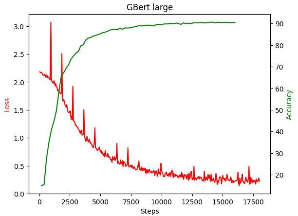
* Testaccuracy: 90.27%, took 0.7174 minutes
* Testaccuracy distribution:
* 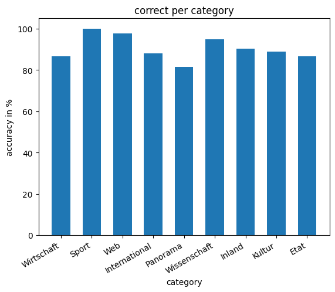
* Confusion matrix:
* 

### T5 Encoder Metrics:
* lr = 2e-6
* batch_size = 8
* loss logged every 50 steps
* eval accuracy logged every 200
* duration: 258.08 minutes
* 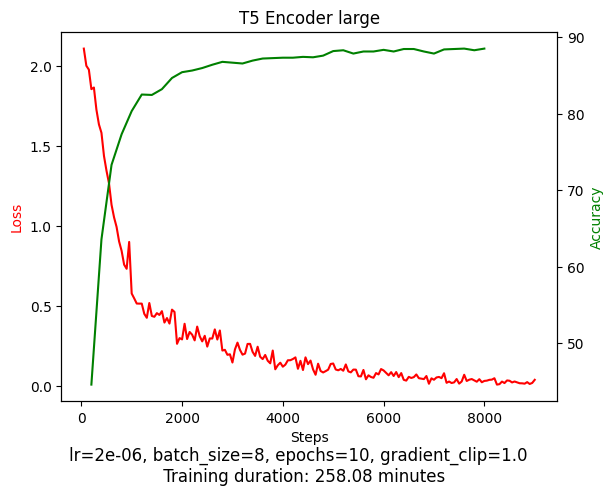
* seems to overfit
* Testaccuracy: 90.27%, took 1.00 minute
* Testaccuracy distribution:
* 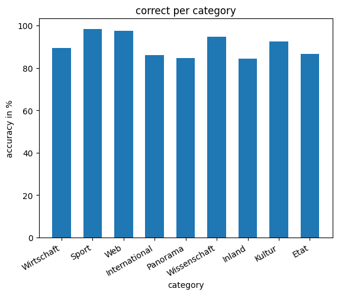
* Confusion matrix:
* 

### T5 Metrics:
* batch size = 8
* epoch 0-9: lr = 2e-5
* epoch 9-14: lr = 2e-6
* loss logged every 50 steps
* eval accuracy logged ever 200 steps
* duration: 152.26 minutes
* 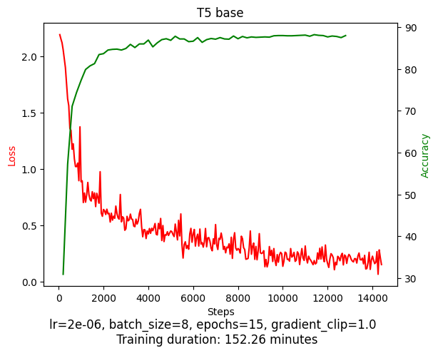
* Testaccuracy: 88.72%, took 0.38 minutes
* Testaccuracy distribution:
* 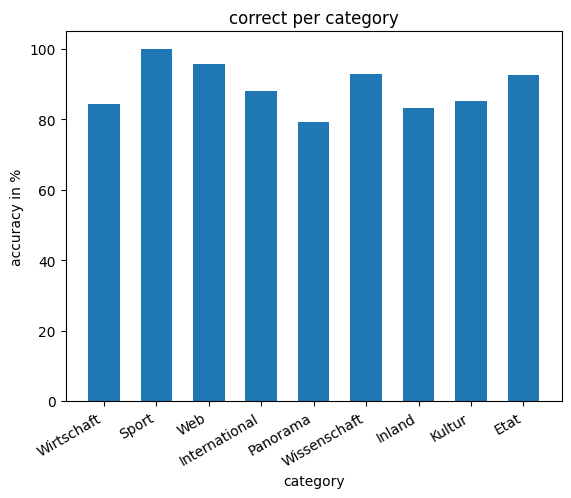
* Confusion matrix:
* 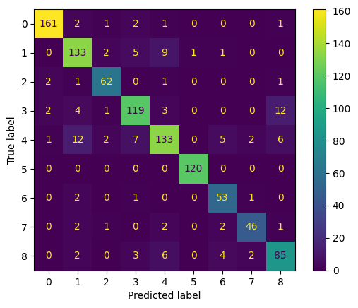

### Llama 3 instruct:
* batch size = 4
* lr = 2.0e-5
* loss logged every 100 steps
* 1 epoch
* duration: 370 minutes (6.17 hours)
* 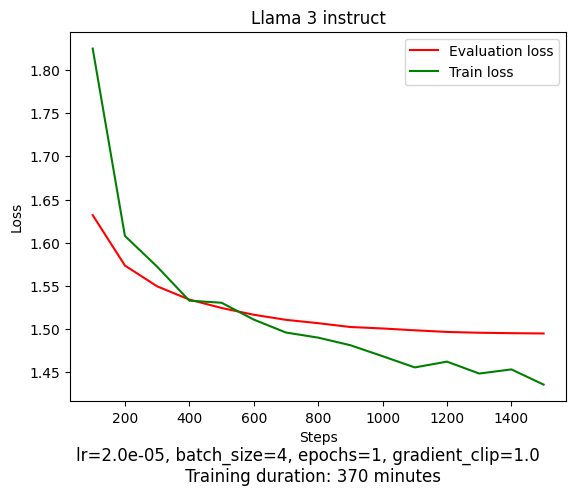
* Testaccuracy: 87.94%, took 27 minutes
* Testaccuracy distribution:
* 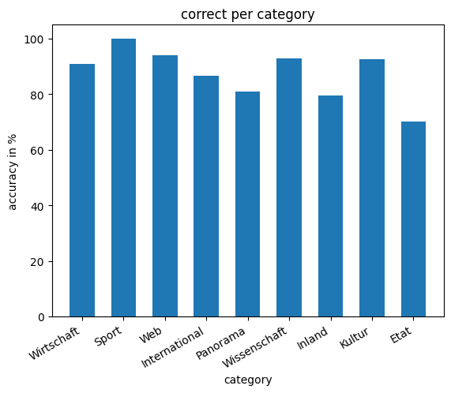
* Confusion matrix:
* 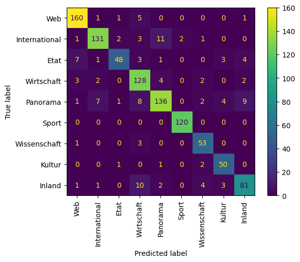

### Llama 3 Classification head:
* batch size = 4
* steps 0-1200: no weight decay, lr = 1e-4
* steps 1200-3000: weight decay = 0.01, lr = 1e-4
* steps 3000-4300: weight decay = 0.01, lr = 1e-5
* duration: 53.05 hours hours
* 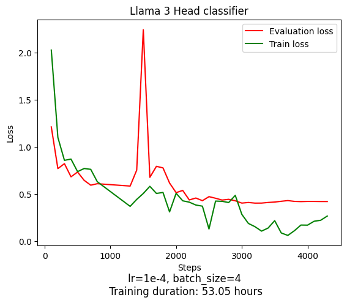
* 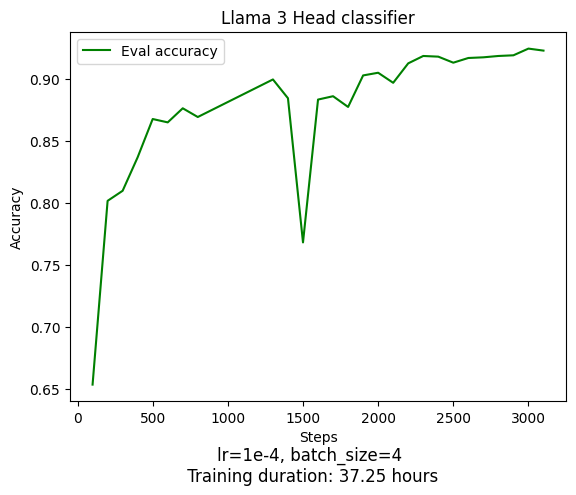
* Testset evaluation duration: 31 minutes
* Testaccuracy: 92.32%
* F1-Score: 92.28%
* Testaccuracy distribution:
* 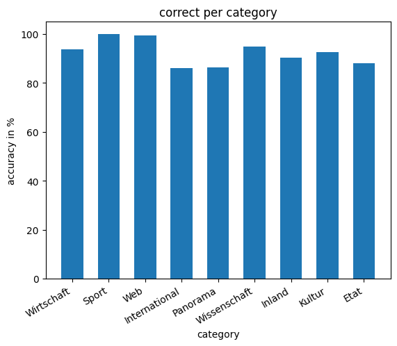
* Confusion matrix:
* 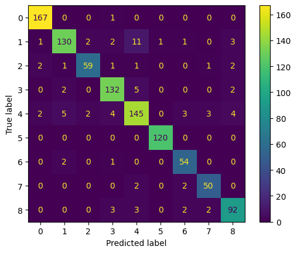
